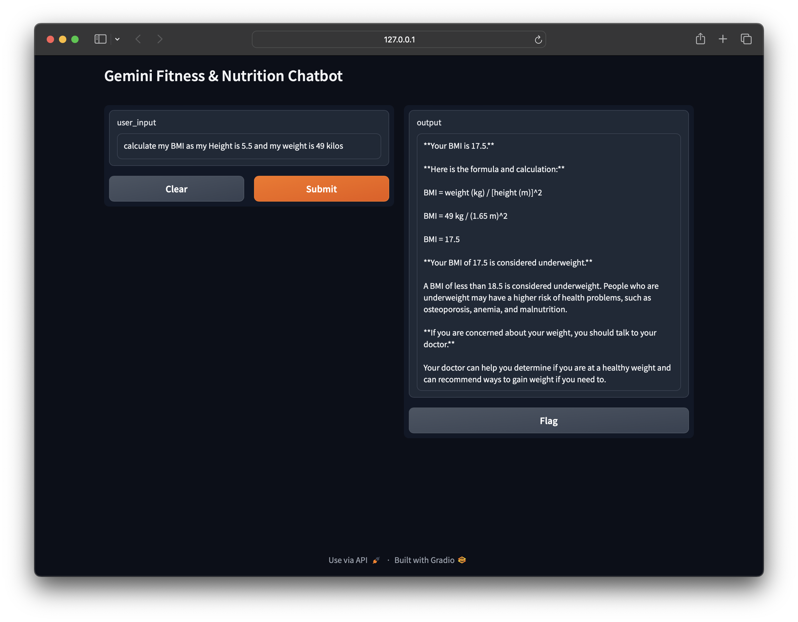

# Gemini Fitness & Nutrition Chatbot

A powerful chatbot powered by the Gemini Advanced API, focused on answering questions related to fitness and nutrition.

## Features

* Employs specialized prompts to guide the Gemini model towards fitness and nutrition expertise.
* User-friendly interface built with Gradio for easy interaction.

## Installation

**Prerequisites:**

* A valid Gemini Advanced API key (obtain from [https://console.cloud.google.com/](https://console.cloud.google.com/)).
* Python 3.9 or newer

**Steps:**

1. **Clone this repository:**
   ```bash
   git clone [https://github.com/your-username/gemini-fitness-chatbot.git](https://github.com/your-username/gemini-fitness-chatbot.git)
## Install Dependencies

```bash
pip install google-generativeai gradio

Set Your API Key
Open chatbot.py.
Replace 'YOUR_API_KEY' with your actual API key.
Launch the Chatbot
bash
python chatbot.py
Interact with the Chatbot
The Gradio interface should open in your browser (typically at http://127.0.0.1:7860).


Contributing
I welcome contributions! Feel free to open pull requests or suggest improvements.

Disclaimer
This chatbot is not intended as a replacement for professional medical or fitness advice. Consult qualified experts before making significant changes to your diet or exercise routine.

